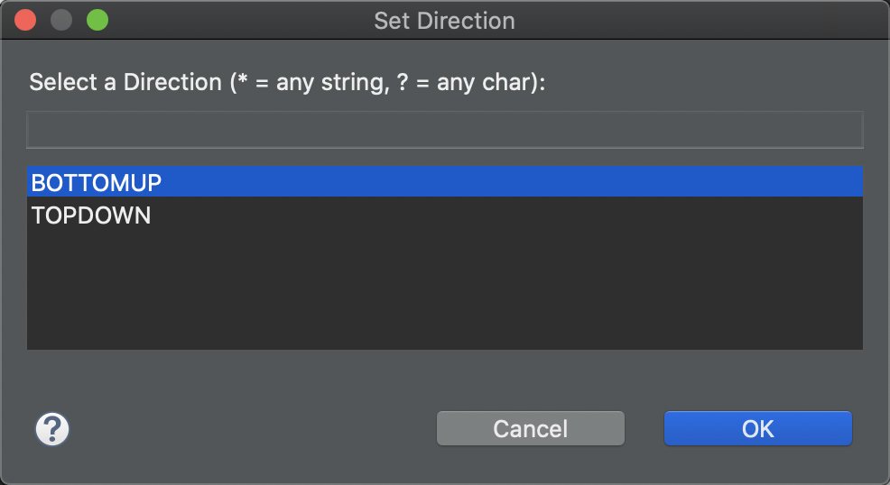
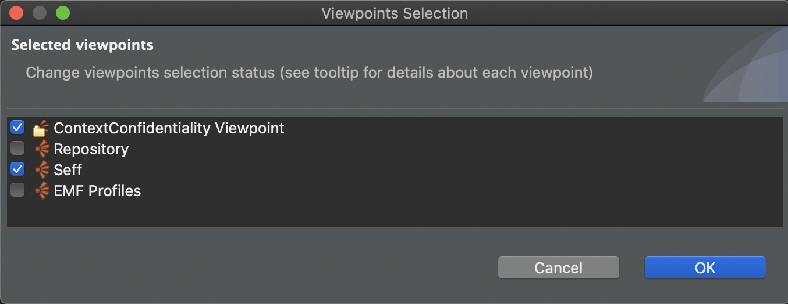
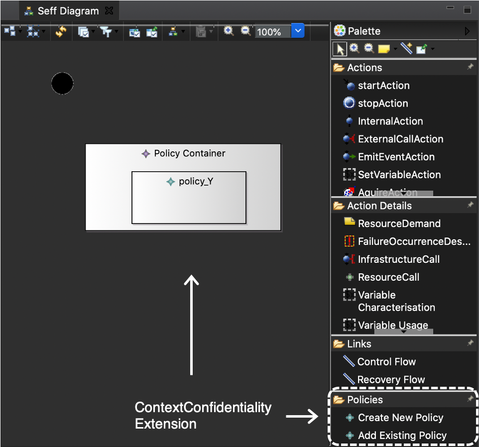
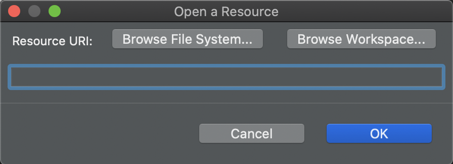
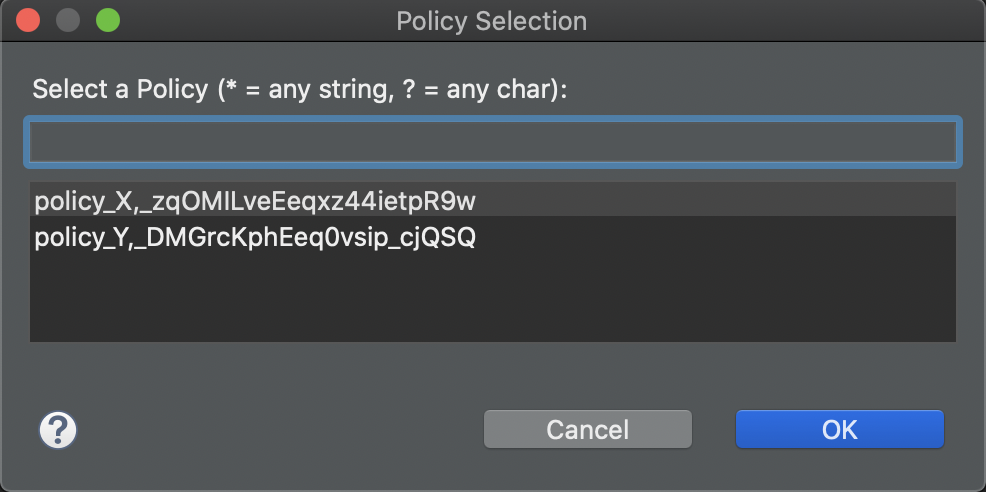
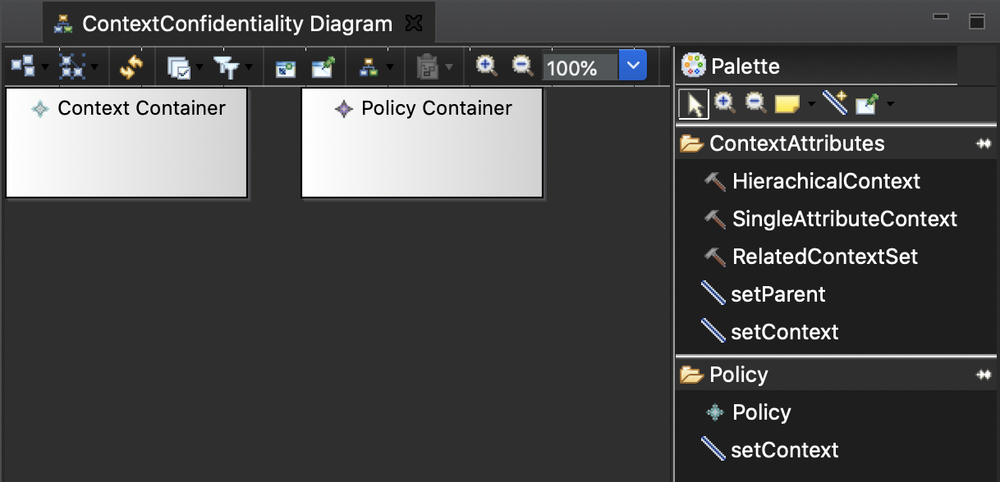
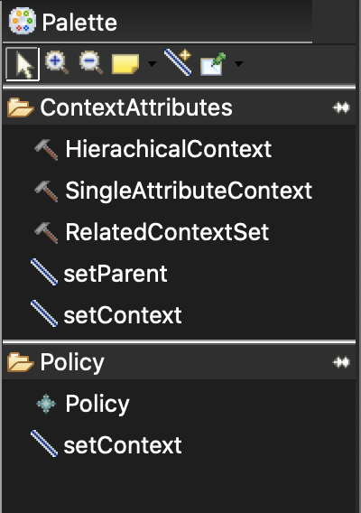
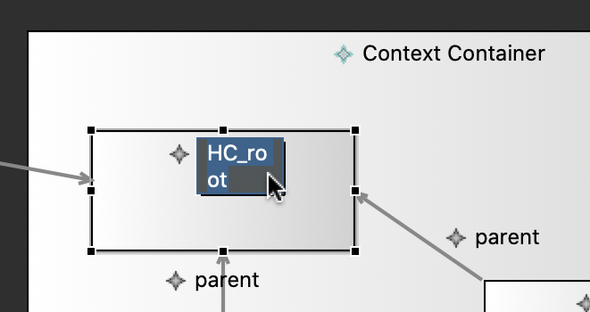
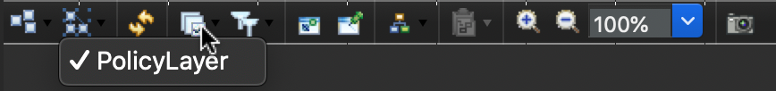
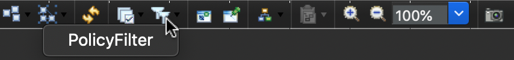

# ContextConfidentiality Editor

[](https://github.com/Trust40-Project/context-confidentiality-editor/blob/master/LICENSE)


This project implements a Sirius-Editor for the Context Confidentiality Metamodel. The editor enables the visualization of confidentiality characteristics within the architectural diagram. It also offers an extension of the Palladio SEFF Editor.

The project was implemented within the scope of the practical master course *Ingenieursmäßige Software-Entwicklung* at the Karlsruhe Institute of Technology.

## Table of contents
* [Technologies](#technologies)
* [Further Development](#further-Development)
* [Functionalities](#functionalities)
* [Design decisions](#design-decisions)
* [Authors](#authors)

## Technologies:
The project is built with:

* Eclipse 2020-06
* Java 11
* [Sirius 6.0.3](https://www.eclipse.org/sirius/)

Following dependencies exist:

* [Palladio Component Model](https://sdqweb.ipd.kit.edu/wiki/Palladio_Component_Model)
* [Context Metamodel](https://github.com/Trust40-Project/Palladio-Addons-DataProcessing-DynamicExtension-ContextModel/tree/context2.0)
* [MDSD Profiles](https://sdqweb.ipd.kit.edu/wiki/MDSDProfiles)

## Further Development
For further development of the editor follow these installation steps:
1. Download and install [Eclipse Modeling Tools](https://www.eclipse.org/downloads/packages/release/2020-06/r/eclipse-modeling-tools)
1. Install the *Sirius Project* through the *Eclipse Marketplace*
1. Download and install *Eclipse plugin dependencies for Palladio development*
    * Go to Eclipse &rarr; Help &rarr; Install New Software
    * Install Palladio from the composite update site: https://updatesite.palladio-simulator.com/palladio-build-updatesite/nightly/
1. Clone and import the *ContextConfidentality Metamodel* repository 
    ```shell
    $ git clone https://github.com/Trust40-Project/Palladio-Addons-DataProcessing-DynamicExtension-ContextModel.git 
    ```
    and checkout the branch **context2.0**
1. Clone and Import the *ContextConfidentiality Editor* repository
    ```shell
    $ git clone https://github.com/Trust40-Project/context-confidentiality-editor.git
    ```
    and checkout the branch **develop**

## Functionalities
A part of the following functionalities are implemented through External Java Actions. These Java Actions can be found in the [contextConfidentiality.externaljavaactions](https://github.com/Trust40-Project/context-confidentiality-editor/tree/develop/contextConfidentiality.externaljavaactions/src/contextconfidentiality) Eclipse Plug-in Project.
### Build a Context Confidentiality Model:
* with Context Attributes:
    * Hierarchical Context
    * Single Attribute Context
    * Related Context Set
* Policies
* and visualization of relations:
    * Parent Relation
    * Context Relation
    </p>

* With double-clicking on a Hierarchical Context its property *direction* can be set. The direction allows to define whether the child elements or the parent elements are included in the hierarchy of the analysis.
    </p>
### Extension of the Palladio SEFF Editor: 
* To extend the SEFF Editor the *ContextConfidentiality* Viewpoint needs to additionaly be selected for the Modeling Project:
    </p>
    </p>

* The tool *Add Existing Policy* within the *Policies* Section enables the extension of the SEFF Model with an existing Policy from a selectable ContextConfidentiality Model. This is done by the application of a [MDSD Profile](https://sdqweb.ipd.kit.edu/wiki/MDSDProfiles) to the SEFF Resource and its Stereotype to the root diagram element *ResourceDemandingSEFF*. The Tagged Value then extends the Property of this model element with the chosen Policy. 
    ```java
    ProfileAPI.applyProfile(resource, ProfileConstants.PROFILE_NAME);
    StereotypeAPI.applyStereotype(seff, ProfileConstants.STEREOTYPE_POLICY);
    StereotypeAPI.setTaggedValue(seff, policy, ProfileConstants.STEREOTYPE_POLICY, ProfileConstants.POLICY_STRING);
    ```
    The full Java Action in which this functionality is implemented can be found [here](https://github.com/Trust40-Project/context-confidentiality-editor/blob/develop/contextConfidentiality.externaljavaactions/src/contextconfidentiality/externaljavaactions/AddExistingPolicyToSeff.java) and its associated service for the application of the Profile, Stereotype and Tagged Value [here](https://github.com/Trust40-Project/context-confidentiality-editor/blob/develop/contextConfidentiality.externaljavaactions/src/contextconfidentiality/service/ApplyProfilesStereotypes.java).

    </p>
    &rarr;
    

* Double-clicking on the added Policy opens the corresponding model within the ContextConfidentiality Editor.
* The other tool *Create New Policy* in the *Policies* Section enables the creation of a new Policy. The newly created Policy is thereby added to the Policy Container of the corresponding ContextConfidentiality Model. 

## Design Decisions
* Adding Context and Policy Container by default on creation of a new model 
    </p> &rarr; Because of their initial requirement

    </p>

* Separating Policy Tools and Context Attribute Tools into different sections in the palette for clear distinction

    </p>
* Double-clicking on Hierarchical Context Attribute for simple setting of its *Direction* property
    </p>
* Simple modification of a container's name by cklicking on its label
    </p>
* Policy and Context Attributes are drawn on different layers
    </p> &rarr; Provides possibility to hide the entire Policy Container
    </p>
* Implementation of a PolicyFilter  
    </p> &rarr; Provides possibility to hide specific Policies.
    </p>
---

### Authors
- [Cynthia Diedrich](https://github.com/peach96)
