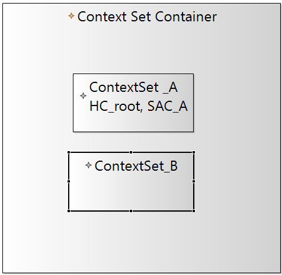

# ContextConfidentiality Editor

[](https://github.com/Trust40-Project/context-confidentiality-editor/blob/master/LICENSE)


This project implements a Sirius-Editor for the Context Confidentiality Metamodel. The editor enables the visualization of confidentiality characteristics within the architectural diagram. It also offers an extension of the Palladio SEFF Editor.

The project was implemented within the scope of the practical master course *Ingenieursmäßige Software-Entwicklung* at the Karlsruhe Institute of Technology.

## Table of contents
* [Technologies](#technologies)
* [Further Development](#further-Development)
* [Functionalities](#functionalities)
* [Design decisions](#design-decisions)
* [Authors](#authors)

## Technologies:
The project is built with:

* Eclipse 2020-09
* Java 11 corretto
* [Sirius 6.3.1](https://www.eclipse.org/sirius/)

Following dependencies exist:

* [Palladio Component Model](https://sdqweb.ipd.kit.edu/wiki/Palladio_Component_Model)
* [Context Metamodel](https://github.com/Trust40-Project/Palladio-Addons-DataProcessing-DynamicExtension-ContextModel/tree/context2.0)
* [MDSD Profiles](https://sdqweb.ipd.kit.edu/wiki/MDSDProfiles)

## Further Development
For further development of the editor follow these installation steps:
1. Download and install [Eclipse Modeling Tools](https://www.eclipse.org/downloads/packages/release/2020-06/r/eclipse-modeling-tools)
1. Install the *Sirius Project* through the *Eclipse Marketplace*
1. Download and install *Eclipse plugin dependencies for Palladio development*
    * Go to Eclipse &rarr; Help &rarr; Install New Software
    * Install Palladio from the composite update site: https://updatesite.palladio-simulator.com/palladio-build-updatesite/nightly/
1. Clone and import the *ContextConfidentality Metamodel* repository 
    ```shell
    $ git clone https://github.com/Trust40-Project/Palladio-Addons-DataProcessing-DynamicExtension-ContextModel.git 
    ```
    and checkout the branch **context2.0**
1. Clone and Import the *ContextConfidentiality Editor* repository
    ```shell
    $ git clone https://github.com/Trust40-Project/context-confidentiality-editor.git
    ```
    and checkout the branch **develop**

## Functionalities

### Build a Context Confidentiality Model:
* with Context Attributes:
    * Hierarchical Context
    * Single Attribute Context
    * Related Context Set
* Policies
    * Policy Specification
    * Context Specification
* and visualization of relations:
    * Includes Relation
    * Policy Relation
    * Attribute Inclusion Relation
    </p>

* With double-clicking on a Hierarchical Context its property *direction* can be set. The direction allows to define whether the child elements or the parent elements are included in the hierarchy of the analysis.
    </p>
* With double-clicking on a Context Set its property *contexts* can be set. The context defines which context attributes are contained in the context set. 
    </p>
    
    
    
    
## Design Decisions

* Separating Policy Tools, Context Attribute Tools and Set Tools into different sections in the palette for clear distinction

    </p>
* Double-clicking on Hierarchical Context Attribute for simple setting of its *Direction* property
    </p>
* Double-clicking on Context Set, showing a list of possible Attributes and a list of already added Attributes for simple setting of its *contexts* property
    </p>
* Showing only the alphabetically sorted names of included Context Attributes in Context Sets to keep the context editor from cluttering
    </p>
* Simple modification of a container's name by clicking on its label
    </p>
* Policy and Context Attributes are drawn on different layers
    </p> &rarr; Provides possibility to hide the entire Policy Container
    </p>
* Implementation of a PolicyFilter  
    </p> &rarr; Provides possibility to hide specific Policies.
    </p>
---

### Authors
- [Cynthia Diedrich](https://github.com/peach96)
- [Erik Kristiansen](https://github.com/DrKingSchultz2)
